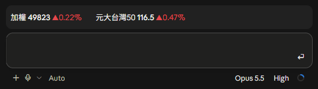
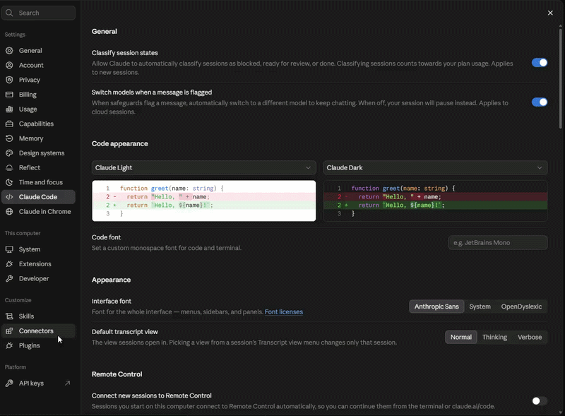

# Claude Code Stock Ticker

[繁體中文](README.md) | **English**

**Claude writes the code. You watch the market.**

Live Taiwan and US stock quotes right above your Claude Code prompt, so you can check your watchlist while Claude works.



- Taiwan stocks, ETFs and indices; US stocks plus the Dow, S&P 500, Nasdaq and SOX
- Refreshes every 5 seconds during market hours, with a toast on big moves
- Works in the terminal and the desktop app, no setup needed

## Install

Requires Claude Code 2.1.287 or later.

**CLI**: type this inside Claude Code:

```
/plugin marketplace add twjackysu/claude-code-stock-ticker
/plugin install stock-ticker@claude-code-stock-ticker
/reload-plugins
```

**Desktop app**: Settings → **Plugins** → **Add** → **Add from a repository**, enter `twjackysu/claude-code-stock-ticker` and press **Sync**, then install **Stock ticker** from **Discover**.



## Usage

```
/stock add 2330 NVDA SOX    add symbols (digits: Taiwan, letters: US)
/stock rm 2330              remove
/stock list                 show quotes
/stock off                  hide (/stock on to show)
```

The default watchlist is TAIEX, 2330 and 0050, up to 10 symbols.

## Settings

Available settings:

| Setting | Default | |
| --- | --- | --- |
| `refreshSeconds` | `5` | Taiwan refresh interval in seconds, minimum 5 |
| `usRefreshSeconds` | `5` | US refresh interval in seconds, minimum 5 |
| `colors` | `red-up` | `red-up` for red gains, `green-up` for green gains |
| `alertPercent` | `3` | Toast once a day per symbol past this move; `0` turns alerts off |

**CLI**: type `/plugin configure stock-ticker` inside Claude Code.

**Desktop app**: run this in a terminal, then restart Claude Code:

```bash
echo '{"refreshSeconds":"10"}' | claude plugin configure stock-ticker@claude-code-stock-ticker --values-stdin
```

## Pair with TWSEMCPServer

For deeper Taiwan market data in Claude (daily candles, institutional trading, monthly revenue, company announcements and more), install [TWSEMCPServer](https://github.com/twjackysu/TWSEMCPServer) separately. The two are independent, so use either or both:

```bash
claude mcp add --transport http --scope user tw-stock https://TW-Stock-MCP-Server.fastmcp.app/mcp
```

The hosted server has a usage limit. For heavy use, self-host it by following the [TWSEMCPServer](https://github.com/twjackysu/TWSEMCPServer) README.

## Notes

- Data sources: TWSE MIS public real-time quotes for Taiwan, Yahoo Finance for the US
- Outside trading hours polling stops and the last quotes stay: Taiwan trades weekdays 08:30–14:00 Taipei time, the US weekdays 09:30–16:00 New York time
- Only the session on screen polls; switching to another session pauses it
- Quotes are for reference only. Not investment advice.

## License

MIT
