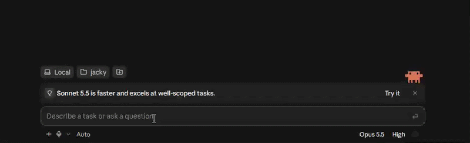

# Claude Code Stock Ticker

[English](README.md) | **繁體中文**

**Claude 在寫 code，你在看盤。**

在 Claude Code 輸入框上方即時顯示台股、美股報價，等 Claude 跑任務的空檔，順便看一下自選股。



- 台股上市、上櫃、ETF、加權、櫃買，美股個股與道瓊、標普、那斯達克、費半
- 盤中每 15 秒更新（最快 5 秒），大漲大跌跳通知
- CLI 和桌面版都能用，裝好不用設定

## 安裝

需要 Claude Code 2.1.287 以上。

**CLI** 在 Claude Code 裡輸入：

```
/plugin marketplace add twjackysu/claude-code-stock-ticker
/plugin install stock-ticker@claude-code-stock-ticker
/reload-plugins
```

**桌面版**：設定 → **Plugins** → **Add** → **Add from a repository**，填入 `twjackysu/claude-code-stock-ticker` 按 **Sync**，再到 **Discover** 安裝 **Stock ticker**。


## 用法

```
/stock add 2330 NVDA 費半   加入自選股（數字是台股，英文是美股）
/stock rm 2330              移除
/stock rm all               清空自選股
/stock list                 列出報價
/stock off                  隱藏（/stock on 顯示）
```

預設自選股是 SPY、QQQ、NVDA、AAPL，最多 10 檔。

## 設定

用 `/stock` 指令修改，立即生效，跨 session 保留：

```
/stock refresh 5            美股每 5 秒更新（預設 15 秒，最少 5 秒）
/stock refresh tw 10        台股每 10 秒更新（預設 15 秒，最少 5 秒）
/stock color green-up       綠漲紅跌；red-up（預設）是紅漲綠跌
/stock alert 5              漲跌超過 5% 時通知，每檔每天一次（預設 3，0 關閉）
/stock settings             顯示目前設定
```

## 更新

第三方 plugin 預設不會自動更新。CLI 在 Claude Code 裡輸入 `/plugin`，到 **Installed** 選 stock-ticker 按 **Update now**；想自動更新的話，到 **Marketplaces** 選 claude-code-stock-ticker 按 **Enable auto-update**。

也可以在終端機執行（先刷新 marketplace，Claude Code 才看得到新版）：

```bash
claude plugin marketplace update claude-code-stock-ticker && claude plugin update stock-ticker@claude-code-stock-ticker
```

## 搭配 TWSEMCPServer

想讓 Claude 幫你查更深入的台股資料（個股日 K、三大法人、月營收、重大訊息⋯），可以另外安裝 [TWSEMCPServer](https://github.com/twjackysu/TWSEMCPServer)。兩個各自獨立，自由搭配：

```bash
claude mcp add --transport http --scope user tw-stock https://TW-Stock-MCP-Server.fastmcp.app/mcp
```

線上服務有使用量上限，用量大的話可以參考 [TWSEMCPServer](https://github.com/twjackysu/TWSEMCPServer) 自行架設。

## 連線到哪裡

- 台股報價連 `mis.twse.com.tw`，美股報價連 `query1.finance.yahoo.com`，只送出你自選股的代號。
- 除此之外不連任何地方：不讀取你的專案或對話內容，也不回傳任何使用資料。

## 說明

- 資料來源：台股為證交所 MIS 公開即時報價，美股為 Yahoo Finance
- 非交易時段停止輪詢，保留最後報價。台股為台北時間平日 08:30–14:00，美股為美東時間平日 09:30–16:00（台北時間約 21:30–04:00，冬令時間 22:30–05:00）
- 只有畫面上正在看的 session 會輪詢，切到別的 session 就暫停
- 報價僅供參考，不構成投資建議

## License

MIT
